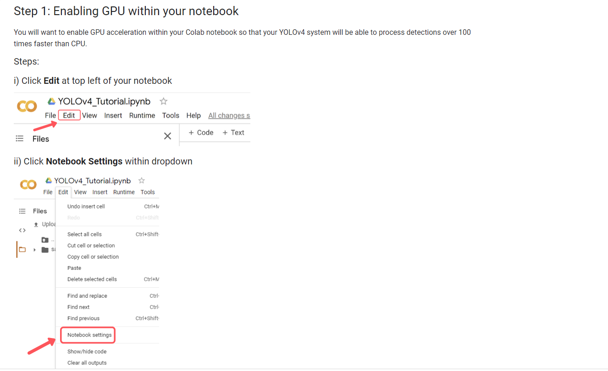
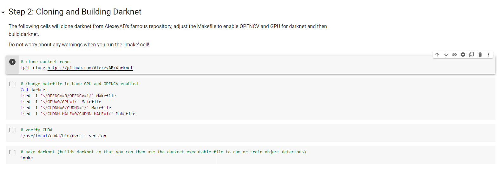
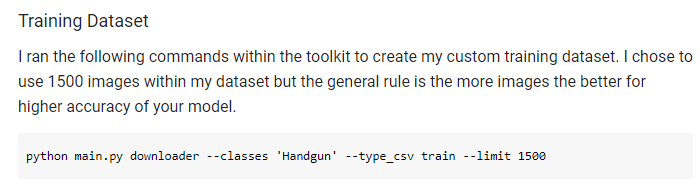
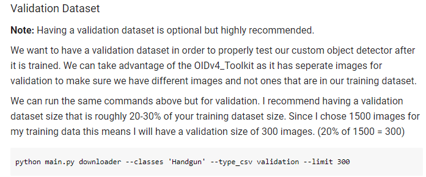
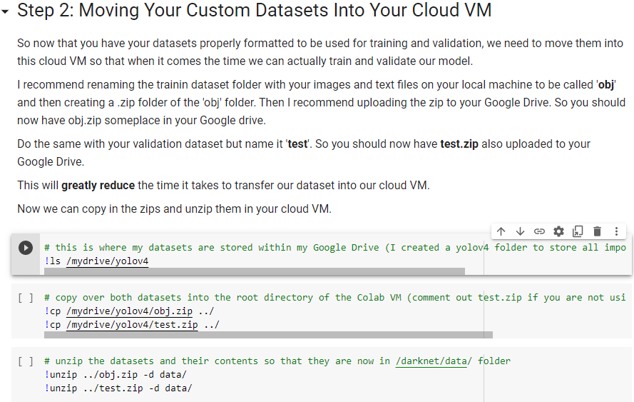
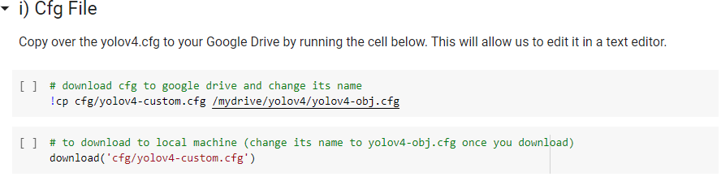
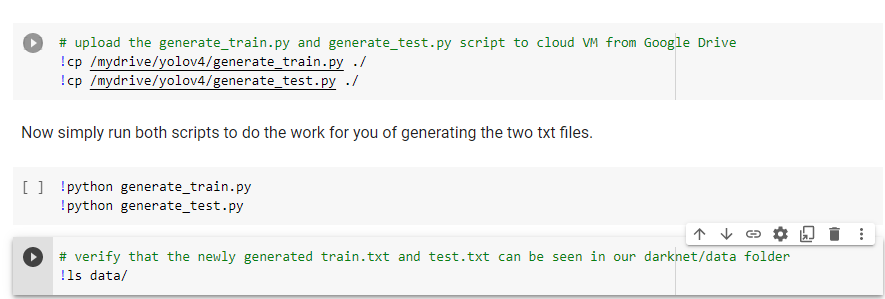
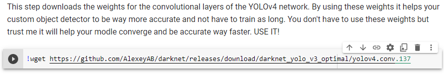
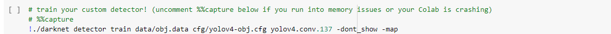
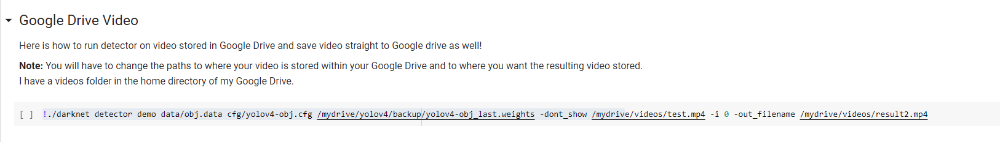

# Suspicious Activity Detection
This repository walks you through how weapon detection is been done.

To follow along with the exact tutorial upload this entire repository to your Google Drive home folder. Then follow along with the notebook by opening it within Google Colab.

### Step1 Enabling GPU

### Step 2 Cloning and Building Darknet

# Train your own Yolov4 Custom Object Detector 

### Step 1 Gathering and labeling Custom Weapon Dataset 

* Training Dataset
* Validation Dataset
* Converting labels to Yolov4 Format 

#### i) Training Dataset

#### ii) Validation Dataset

#### iii) Converting labels to Yolov4 Format
The labels that we get from the toolkit are not in the proper YOLOv4 format. Luckily, with a few simple commands we can convert them to the proper format.

Within the root OIDv4_ToolKit folder open the file classes.txt and edit it to have the classes you just downloaded, one per line.

### Step 2 Moving Custom Dataset to Cloud VM

### Step 3 Configuring Files for Training
* Cfg File
* obj.name and obj.data
* Generate train.txt and test.txt 

#### i) Cfg File

#### ii)obj.name and obj.data
Create a new file within a code or text editor called obj.names where you will have one class name per line in the same order as your classes.txt from the dataset generation step.

#### iii) Generate train.txt and test.txt

### Step 3 Download pre- trained weights for the convolutional layers 

### step 4 Train your Custom Object Detector

### Step 5 Run your custom object detector

